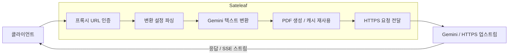

# Sateleaf 사용 가이드

Sateleaf는 Gemini 네이티브 API 요청의 긴 텍스트 컨텍스트를 PDF 첨부파일로 변환한 뒤 업스트림 서버로 전달하는 HTTPS 리버스 프록시입니다.

일반적으로 사용하는 `maximum`과 `balanced` 모드에서는 **프롬프트를 수정할 필요가 없습니다.** 평소처럼 Gemini 요청을 보내면 Sateleaf가 자동으로 텍스트를 PDF로 변환합니다.

`<pdf>...</pdf>` 태그는 특정 부분만 선택적으로 변환하는 `marked` 계열 모드에서만 필요합니다.

PageFold에서 아이디어를 얻었습니다.

## 주요 기능

- Gemini 네이티브 API의 텍스트 컨텍스트를 PDF로 변환
- `maximum`, `balanced`에서는 프롬프트 수정 불필요
- `marked` 모드에서는 원하는 구간만 선택적으로 PDF 변환
- 요청 URL을 이용한 동적 HTTPS 업스트림 선택
- 변환 대상이 아닌 요청은 일반 프록시처럼 전달
- Gemini SSE 스트리밍 응답 유지
- 이미지 등 비텍스트 Gemini part 보존
- 결정적인 PDF 생성
- 제한된 로컬 PDF 캐시
- 요청별 `nocache` 지원
- CORS 지원
- 데이터베이스나 영구 스토리지 불필요

## 토큰 절감 효과

2026-09-21 OOTB 스모크 측정에서 `gemini-3.5-flash-lite`, `fontsize_2`, `nocache`를 사용했습니다. 45,472자 문서 입력의 네이티브 기준은 17,056토큰이었고, Sateleaf 경유 시 `maximum`은 324토큰(**98.1%**), `balanced`는 3,490토큰(**79.5%**)이었습니다.

유즈케이스별 긴 입력에서도 같은 경향을 확인했습니다.

| 유즈케이스           | 입력 크기 | 네이티브 기준 | `maximum`       | `balanced`        |
| -------------------- | --------: | ------------: | --------------- | ----------------- |
| 코딩 어시스턴트      | 174,926자 |        42,990 | 324 (**99.2%**) | 1,715 (**96.0%**) |
| RPG / 장기 소셜 채팅 | 414,310자 |        89,057 | 590 (**99.3%**) | 1,827 (**97.9%**) |

수치는 업스트림 `countTokens`와 Sateleaf `generateContent`의 프롬프트 토큰 비교입니다. 출력 토큰, 지연시간, 품질, 실제 과금 절감 보장은 포함하지 않습니다.

## 동작 방식



지원되는 Gemini `generateContent` 요청은 선택한 모드에 따라 변환됩니다.

그 외 요청은 PDF 변환 없이 일반 HTTPS 프록시처럼 전달됩니다.

## 변환 모드

Sateleaf는 네 가지 PDF 변환 방식을 지원합니다.

대부분의 경우 `balanced` 또는 `maximum`을 사용하면 됩니다. 이 두 모드는 일반 Gemini 프롬프트를 그대로 사용할 수 있습니다.

| 모드              | 프롬프트 수정 필요 | 동작                                        |
| ----------------- | ------------------ | ------------------------------------------- |
| `maximum`         | 필요 없음          | 시스템 지시와 대화 전체를 PDF로 변환        |
| `balanced`        | 필요 없음          | 시스템 지시는 그대로 두고 대화만 PDF로 변환 |
| `marked`          | 필요               | `<pdf>...</pdf>` 안쪽만 PDF로 변환          |
| `marked_combined` | 필요               | 각 `<pdf>` 구간을 별도 PDF로 변환           |

### `maximum`

```text
mode_maximum
```

시스템 지시와 대화 전체를 PDF 컨텍스트로 변환합니다.

프롬프트는 평소처럼 보내면 됩니다.

```json
{
    "contents": [
        {
            "role": "user",
            "parts": [
                {
                    "text": "아주 긴 프롬프트..."
                }
            ]
        }
    ]
}
```

`<pdf>` 태그를 추가할 필요가 없습니다.

네이티브 Gemini 텍스트의 양을 가능한 한 줄이고 싶을 때 적합합니다.

### `balanced`

```text
mode_balanced
```

대화 내용은 PDF로 변환하고 시스템 지시는 기존 Gemini 네이티브 텍스트로 유지합니다.

이 모드 역시 프롬프트를 수정할 필요가 없습니다.

일반적인 사용에서 가장 무난한 절충 모드입니다.

### `marked`

```text
mode_marked
```

`<pdf>...</pdf>` 안에 있는 텍스트만 PDF로 변환합니다.

```xml
이 부분은 네이티브 텍스트입니다.

<pdf>
이 부분만 PDF로 변환됩니다.
</pdf>

이 부분은 다시 네이티브 텍스트입니다.
```

특정 부분만 PDF로 보내고 싶을 때 사용합니다.

`<pdf>` 태그가 하나도 없다면 선택적으로 변환할 텍스트도 없습니다.

### `marked_combined`

```text
mode_marked_combined
```

`marked`와 비슷하지만 각 `<pdf>` 구간을 별도의 PDF 첨부파일로 생성합니다.

```text
root / PART 1
root / PART 2
root / PART 3
...
```

이 모드에서는 marker의 `name=` 속성을 무시합니다.

## 설치

필요한 환경:

- Node.js 22 이상
- pnpm 10

저장소를 내려받습니다.

```sh
git clone https://github.com/concertypin/sateleaf.git
cd sateleaf

corepack enable
pnpm install --frozen-lockfile
```

프록시 접근에 사용할 secret을 설정합니다.

```sh
export PROXY_SECRET="a-long-readable-secret"
```

필요하다면 최대 요청 크기도 지정할 수 있습니다.

```sh
export MAX_REQUEST_BYTES=26214400
```

개발 서버 실행:

```sh
pnpm dev
```

프로덕션 빌드 및 실행:

```sh
pnpm build
pnpm start
```

프로덕션 서버는 `PORT` 환경변수를 사용하며, 지정하지 않으면 `3000` 포트에서 실행됩니다.

## 기본 엔드포인트

상태 확인:

```text
GET /
GET /health
```

런타임 사용 설명서:

```text
GET /docs
```

`/docs`는 Markdown 문서를 반환합니다.

## 프록시 URL

기본 형식:

```text
https://your-sateleaf.example/proxy/{proxy-secret}/{settings}/{upstream-host-and-path}
```

예시:

```text
https://your-sateleaf.example/proxy/my-secret/mode_balanced,fontsize_1/generativelanguage.googleapis.com/v1beta/models/gemini-3.8-flash:generateContent
```

업스트림 부분에는 `https://`를 넣지 않습니다.

Sateleaf가 자동으로 HTTPS 스킴을 붙입니다.

쿼리 문자열은 일반 URL처럼 뒤에 붙입니다.

```text
.../generativelanguage.googleapis.com/v1beta/models/gemini-3.8-flash:streamGenerateContent?alt=sse
```

설정 영역에는 `.`을 넣으면 안 됩니다.

점은 업스트림 호스트 및 경로 부분을 구분하는 데 사용됩니다.

## 설정 문법

설정은 쉼표로 구분합니다.

```text
mode_balanced,fontsize_1
```

다음과 같은 형식도 사용할 수 있습니다.

```text
mode=balanced,fontSize=1
```

고정된 base URL만 설정할 수 있는 클라이언트에서는 언더스코어 형식이 편리합니다.

## PDF 글자 크기

```text
fontsize_1
```

`0`보다 크고 `12` 이하인 값을 사용할 수 있습니다.

예:

```text
mode_balanced,fontsize_2
```

## 캐시 비활성화

설정에 `nocache`를 추가합니다.

```text
mode_balanced,fontsize_1,nocache
```

해당 요청에서는 PDF 캐시 파일을 읽거나 쓰지 않습니다.

변환된 프롬프트가 로컬 임시 디렉터리에 남는 것을 피하고 싶을 때 사용할 수 있습니다.

## Gemini 요청 예시

`balanced` 또는 `maximum`에서는 별도의 Sateleaf 전용 태그를 넣지 않아도 됩니다.

일반 Gemini 요청을 그대로 보냅니다.

```sh
curl \
  -X POST \
  -H "Content-Type: application/json" \
  -H "x-goog-api-key: YOUR_GEMINI_API_KEY" \
  "https://your-sateleaf.example/proxy/YOUR_PROXY_SECRET/mode_balanced,fontsize_1/generativelanguage.googleapis.com/v1beta/models/gemini-3.8-flash:generateContent" \
  -d '{
    "contents": [
      {
        "role": "user",
        "parts": [
          {
            "text": "Hello from Sateleaf"
          }
        ]
      }
    ]
  }'
```

Sateleaf가 대화 텍스트를 자동으로 PDF로 변환한 뒤 업스트림으로 전달합니다.

다음과 같은 인증 헤더도 그대로 업스트림에 전달됩니다.

```text
Authorization: Bearer ...
X-Goog-API-Key: ...
```

Sateleaf는 공급자별 인증 방식을 별도로 해석하지 않습니다.

프록시 과정에서 다시 생성해야 하는 일부 헤더만 제거합니다.

```text
Host
Content-Length
Connection
Transfer-Encoding
```

## 변환 대상 엔드포인트

현재 PDF 변환 대상:

```text
POST .../models/:model:generateContent
```

스트리밍:

```text
POST .../models/:model:streamGenerateContent?alt=sse
```

그 외 메서드와 경로는 PDF 변환 없이 그대로 전달됩니다.

SSE 응답 역시 전체 내용을 메모리에 버퍼링하지 않고 스트림 형태로 전달합니다.

## 이미지와 멀티모달 컨텍스트

Sateleaf의 PDF 변환 대상은 텍스트입니다.

이미지 등 기존 비텍스트 Gemini part는 유지됩니다.

예를 들어 한 user turn 안에:

```text
텍스트
이미지
텍스트
```

가 들어 있다면 변환 후에도 이미지와 생성된 PDF는 같은 원본 user turn에 유지됩니다.

Sateleaf는 하나의 원본 Gemini content를 여러 개의 가상 turn으로 분리하지 않습니다.

## PDF 캐시

생성된 PDF는 운영체제의 임시 디렉터리에 캐시될 수 있습니다.

| 항목                 | 값     |
| -------------------- | ------ |
| 최대 엔트리 수       | 64     |
| 전체 크기            | 32 MiB |
| PDF 하나의 최대 크기 | 8 MiB  |
| TTL                  | 10분   |

캐시 파일 이름은 SHA-256 해시이므로 프롬프트 텍스트 자체가 파일명에 들어가지는 않습니다.

다만 PDF 파일 내부에는 실제 변환된 프롬프트 내용이 포함됩니다.

캐시를 사용하지 않으려면:

```text
nocache
```

를 추가합니다.

Sateleaf는 동일한 입력에서 가능한 한 안정적인 PDF와 요청 prefix를 생성하도록 설계되어 있습니다.

이를 통해 Gemini의 implicit prompt caching이 재사용될 가능성을 유지하려 하지만, 실제 캐시 적중 여부는 업스트림 동작에 따라 달라집니다.

## CORS

브라우저의 `OPTIONS` preflight 요청은 Sateleaf가 직접 처리합니다.

요청에 `Origin`이 포함된 경우:

- 해당 Origin을 `Access-Control-Allow-Origin`으로 반영
- 요청된 헤더 허용
- credentials 허용
- 응답 헤더 노출
- `Vary: Origin` 추가

`Origin`이 없는 요청에는 CORS 헤더를 추가하지 않습니다.

## 환경변수

### `PROXY_SECRET`

필수입니다.

```text
PROXY_SECRET=a-long-readable-secret
```

프록시 URL의 secret이 이 값과 일치해야 합니다.

### `MAX_REQUEST_BYTES`

최대 요청 본문 크기입니다.

```text
MAX_REQUEST_BYTES=26214400
```

유효한 양의 바이트 값을 사용해야 합니다.

### `PORT`

프로덕션 서버 포트입니다.

```text
PORT=3000
```

지정하지 않으면 `3000`을 사용합니다.

## Heroku 배포

```sh
corepack enable
pnpm install --frozen-lockfile
pnpm check

heroku create your-sateleaf
heroku config:set PROXY_SECRET="a-long-readable-secret"

git push heroku main
```

클라이언트가 base URL과 Bearer token만 설정할 수 있다면 Sateleaf의 `/proxy/.../` 부분까지를 base URL로 지정하고 실제 공급자 API 키를 Bearer token으로 넣을 수 있습니다.

이 경우:

- Sateleaf의 `PROXY_SECRET`은 URL에 포함됩니다.
- Bearer token은 수정하지 않고 업스트림으로 전달됩니다.

## 개발 명령어

```sh
pnpm dev
pnpm build
pnpm test

pnpm format
pnpm format:check

pnpm lint
pnpm lint:check

pnpm check
```

`pnpm check`는 포맷, 린트, 테스트를 실행합니다.

주요 스택:

- TypeScript
- Hono
- Vite
- Vitest
- oxlint
- oxfmt

## 실제 PDF 처리 여부 확인

Gemini가 생성된 PDF를 실제 컨텍스트로 읽었는지 확인하려면 PDF로 변환될 원문에 고유한 문자열을 넣은 뒤 모델에게 다시 출력하도록 요청할 수 있습니다.

예:

```text
SATELEAF_SENTINEL_6E7A42
```

추가로 응답의 다음 항목을 확인할 수 있습니다.

```text
usageMetadata.promptTokensDetails
```

생성된 PDF가 멀티모달 입력으로 처리되었다면 `IMAGE` 항목이 나타나는지 확인할 수 있습니다.

## 보안 관련 주의사항

Sateleaf는 요청 URL에 지정된 HTTPS 호스트로 동적으로 요청을 전달합니다.

`PROXY_SECRET`은 외부에 노출하지 않는 것이 좋습니다.

특히 secret이 URL 경로에 포함되므로 reverse proxy, CDN, PaaS 등의 access log에 기록될 수 있습니다.

또한 공급자 API 키와 인증 헤더가 Sateleaf를 거쳐 업스트림으로 전달됩니다. 신뢰할 수 있는 환경에만 배포해야 합니다.

PDF 캐시를 사용하는 경우 변환된 프롬프트 내용이 운영체제의 임시 디렉터리에 최대 TTL 동안 남을 수 있습니다.

민감한 요청에서는 `nocache` 사용을 고려하세요.

## 라이선스

MIT
