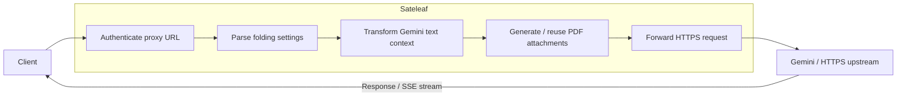

# Sateleaf

A PDF-folding HTTPS reverse proxy for native Gemini requests.

Sateleaf sits between a client and a Gemini-compatible HTTPS upstream, converts long text context into PDF attachments, and forwards the transformed request upstream.

For the common `maximum` and `balanced` modes, **no prompt modification is required**. Clients can send ordinary Gemini requests as-is. `<pdf>...</pdf>` markers are only needed when using the `marked` modes.

Inspired by PageFold.

## Features

- PDF folding for native Gemini requests
- No prompt changes required for `maximum` or `balanced`
- Optional `<pdf>...</pdf>` markers for selective folding
- Dynamic HTTPS upstream routing
- Transparent pass-through for unsupported paths and methods
- Streaming-safe Gemini SSE forwarding
- Deterministic PDF generation
- Bounded local PDF cache with per-request bypass
- Preservation of non-text parts such as images
- CORS support
- No database or persistent storage required

## Token-saving results

An OOTB smoke measurement on 2026-09-21 used `gemini-3.5-flash-lite`, `fontsize_2`, and `nocache`. With a 45,472-character documentation input, the native baseline was 17,056 tokens. Sateleaf reduced the prompt count to 324 tokens (**98.1%**) in `maximum` mode and 3,490 tokens (**79.5%**) in `balanced` mode.

Longer, use-case-shaped fixtures showed the same pattern:

| Use case               |    Input size | Native baseline | `maximum`       | `balanced`        |
| ---------------------- | ------------: | --------------: | --------------- | ----------------- |
| Coding assistant       | 174,926 chars |          42,990 | 324 (**99.2%**) | 1,715 (**96.0%**) |
| RPG / long social chat | 414,310 chars |          89,057 | 590 (**99.3%**) | 1,827 (**97.9%**) |

These are prompt-token measurements from upstream `countTokens` versus Sateleaf `generateContent`; output tokens, latency, quality, and guaranteed billing savings are not included.

## How it works



Supported Gemini `generateContent` requests are transformed according to the selected mode.

Requests that do not match a supported transformation path are forwarded transparently.

## Folding modes

Sateleaf supports four folding modes.

For most clients, use `balanced` or `maximum`. These modes work with normal Gemini prompts and require no special tags.

| Mode              | Prompt modification required? | Behavior                                                       |
| ----------------- | ----------------------------- | -------------------------------------------------------------- |
| `maximum`         | No                            | Folds the complete system instruction and conversation         |
| `balanced`        | No                            | Keeps the system instruction native and folds the conversation |
| `marked`          | Yes                           | Folds only text inside `<pdf>...</pdf>`                        |
| `marked_combined` | Yes                           | Folds each marked section into a separate PDF                  |

### `maximum`

```text
mode_maximum
```

Folds the complete system instruction and conversation into PDF context.

The client can send an ordinary Gemini request:

```json
{
    "contents": [
        {
            "role": "user",
            "parts": [
                {
                    "text": "A very long prompt..."
                }
            ]
        }
    ]
}
```

No `<pdf>` marker is required.

Use this mode when minimizing native Gemini text is the main goal.

### `balanced`

```text
mode_balanced
```

Folds conversation text into PDF context while keeping the system instruction as native Gemini text.

No prompt modification or marker is required.

This is the general-purpose mode when you want to preserve the system instruction as native text while folding the conversation.

### `marked`

```text
mode_marked
```

Only text explicitly wrapped in `<pdf>...</pdf>` is folded.

```xml
This remains native text.

<pdf>
This section becomes PDF context.
</pdf>

This remains native text too.
```

Use this mode when individual sections of a prompt need different treatment.

If no `<pdf>` marker is present, there is no marked text to fold.

### `marked_combined`

```text
mode_marked_combined
```

Works like `marked`, but each marked section becomes a separate PDF attachment:

```text
root / PART 1
root / PART 2
root / PART 3
...
```

Any marker `name=` attribute is ignored in this mode.

## Requirements

- Node.js 22 or newer
- pnpm 10

The repository currently pins:

```text
pnpm@10.33.2
```

## Quick start

```sh
git clone https://github.com/concertypin/sateleaf.git
cd sateleaf

corepack enable
pnpm install --frozen-lockfile
```

Set a proxy secret:

```sh
export PROXY_SECRET="a-long-readable-secret"
```

Optionally configure the maximum accepted request size:

```sh
export MAX_REQUEST_BYTES=26214400
```

Start the development server:

```sh
pnpm dev
```

For production:

```sh
pnpm build
pnpm start
```

The production server listens on `PORT`, or `3000` when `PORT` is not set.

## Basic endpoints

Health and status:

```text
GET /
GET /health
```

Runtime usage documentation:

```text
GET /docs
```

`/docs` returns Markdown.

## Proxy URL

Requests use the following format:

```text
https://your-sateleaf.example/proxy/{proxy-secret}/{settings}/{upstream-host-and-path}
```

Example:

```text
https://your-sateleaf.example/proxy/my-secret/mode_balanced,fontsize_1/generativelanguage.googleapis.com/v1beta/models/gemini-3.8-flash:generateContent
```

The upstream portion must not include `https://`. Sateleaf prepends HTTPS automatically.

Query parameters are appended normally:

```text
.../generativelanguage.googleapis.com/v1beta/models/gemini-3.8-flash:streamGenerateContent?alt=sse
```

The settings segment must not contain a dot (`.`). Dots are reserved for the upstream host and path portion.

## Settings

Settings are comma-separated:

```text
mode_balanced,fontsize_1
```

Equals-style syntax is also accepted:

```text
mode=balanced,fontSize=1
```

The underscore form is convenient for clients that only support a fixed base URL.

### Font size

```text
fontsize_1
```

Any positive value up to `12` is accepted.

### Disable caching

Add `nocache`:

```text
mode_balanced,fontsize_1,nocache
```

This skips all PDF-cache filesystem access for that request.

## Gemini example

The request body does not need any special Sateleaf syntax when using `balanced` or `maximum`.

```sh
curl \
  -X POST \
  -H "Content-Type: application/json" \
  -H "x-goog-api-key: YOUR_GEMINI_API_KEY" \
  "https://your-sateleaf.example/proxy/YOUR_PROXY_SECRET/mode_balanced,fontsize_1/generativelanguage.googleapis.com/v1beta/models/gemini-3.8-flash:generateContent" \
  -d '{
    "contents": [
      {
        "role": "user",
        "parts": [
          {
            "text": "Hello from Sateleaf"
          }
        ]
      }
    ]
  }'
```

Sateleaf automatically folds the conversation text before forwarding the request.

Authentication and provider-specific headers are passed upstream, including:

```text
Authorization: Bearer ...
X-Goog-API-Key: ...
```

Sateleaf removes only framing or hop-by-hop headers that need to be regenerated, such as:

```text
Host
Content-Length
Connection
Transfer-Encoding
```

## Supported transformations

Sateleaf currently transforms:

```text
POST .../models/:model:generateContent
```

and streaming requests:

```text
POST .../models/:model:streamGenerateContent?alt=sse
```

Other methods and paths are forwarded without PDF transformation.

Upstream status codes, response bodies, and streams are preserved aside from proxy framing and CORS handling.

## Media and turn preservation

PDF folding only transforms text.

Non-text Gemini parts, including images, are preserved.

A source Gemini content entry remains a single content entry after transformation. Generated PDFs are attached to the originating user turn rather than emitted as synthetic extra turns.

## Caching and retention

Generated PDFs are deterministic and may be reused from a temporary local cache.

| Limit              | Value      |
| ------------------ | ---------- |
| Entries            | 64         |
| Total size         | 32 MiB     |
| Maximum entry size | 8 MiB      |
| TTL                | 10 minutes |

Cache filenames are SHA-256 digests and do not contain prompt text.

The cached PDF itself still contains the transformed prompt content and remains in the operating system's temporary directory until eviction.

Use `nocache` when local retention is undesirable.

Sateleaf attempts to preserve stable transformed request prefixes so that upstream Gemini implicit caching can remain useful, but upstream cache hits are not guaranteed.

## CORS

Sateleaf handles `OPTIONS` preflight requests locally.

When an `Origin` header is present, it:

- reflects the request origin,
- reflects requested headers,
- allows credentials,
- exposes response headers,
- adds `Vary: Origin`.

Requests without an `Origin` header receive no CORS headers.

## Environment variables

### `PROXY_SECRET`

Required.

```text
PROXY_SECRET=a-long-readable-secret
```

Multiple secrets may be configured as a comma-separated list. Whitespace
around entries is ignored:

```text
PROXY_SECRET=primary-secret, backup-secret
```

The proxy secret in the request URL must match one of these values.

### `MAX_REQUEST_BYTES`

Maximum accepted request body size:

```text
MAX_REQUEST_BYTES=26214400
```

The value must be a valid positive byte count.

### `PORT`

Production listening port:

```text
PORT=3000
```

Defaults to `3000`.

## Heroku

```sh
corepack enable
pnpm install --frozen-lockfile
pnpm check

heroku create your-sateleaf
heroku config:set PROXY_SECRET="a-long-readable-secret"

git push heroku main
```

For clients that expose only a base URL and Bearer-token field, the fixed Sateleaf `/proxy/.../` prefix can be used as the base URL while the provider API key is supplied as the Bearer token.

The proxy secret remains part of the URL, while the `Authorization` value is forwarded upstream.

## Development

```sh
pnpm dev
pnpm build
pnpm test

pnpm format
pnpm format:check

pnpm lint
pnpm lint:check

pnpm check
```

`pnpm check` formats, lints, and runs the test suite.

Main technologies:

- TypeScript
- Hono
- Vite
- Vitest
- oxlint
- oxfmt

## Verifying PDF context

To verify that Gemini actually processed the generated PDF, include a unique sentinel string in text that will be folded and ask the model to repeat it.

You can also inspect:

```text
usageMetadata.promptTokensDetails
```

When the generated PDF is processed as multimodal context, an `IMAGE` entry should appear.

## Security notes

Sateleaf can proxy to dynamically selected HTTPS hosts. Keep `PROXY_SECRET` private and do not expose an instance without access control.

The proxy secret is carried in the URL and may therefore appear in reverse-proxy, CDN, or PaaS access logs.

Provider credentials are forwarded through Sateleaf to the selected upstream. Deploy Sateleaf only on infrastructure you trust.

Generated PDFs may temporarily contain prompt contents unless `nocache` is enabled.

## License

MIT
